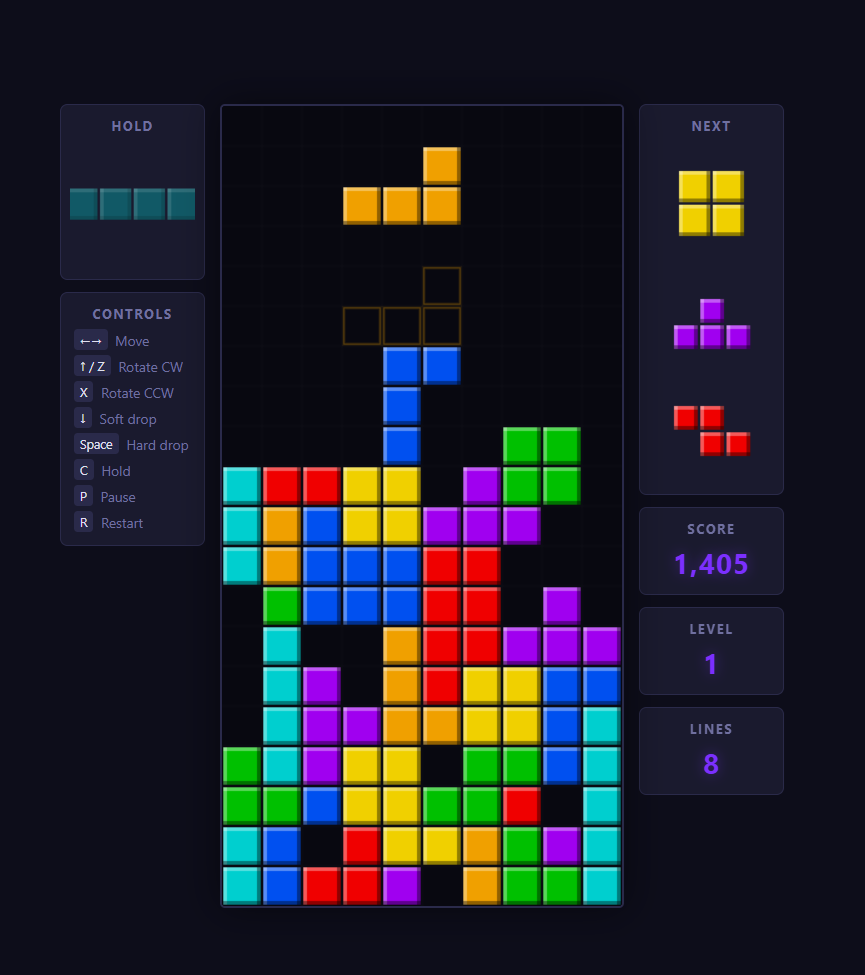
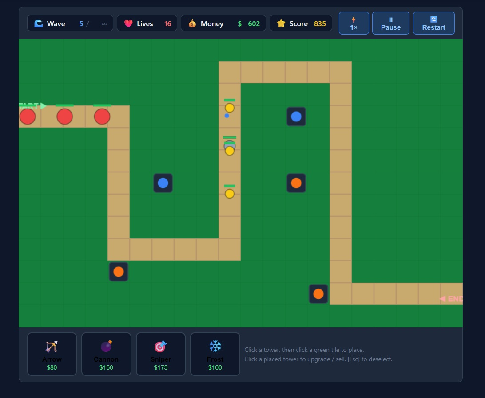

# One Prompt Applications

This is a collection of simple, fully working applications created for at least 95% from a single prompt. The remaining 5% tolerance reflects the fact that one or more versions required minor adjustments to fix small issues in the graphics or calculations.

Each application in this repository is a small, self-contained project designed to demonstrate how far a single well-written prompt can go in producing usable software. The examples cover practical logic, interface behaviour, and core features, making the collection useful both as a showcase and as a learning resource for AI-driven development and publishing.

## Tetris

The Tetris example is an MVP implementation of the classic block-stacking game, built to demonstrate core gameplay mechanics, playability, and prompt-driven development in a compact format. It is intended as a practical example of how a single prompt can produce a working game with only limited post-generation refinements.

This application is available in three versions: one generated by **Claude Sonnet 4.6** (the strongest from a graphics and design point of view), one generated by **GPT-5.3-codex** (equally valid in gameplay terms, but with a slightly rougher presentation), and one generated by **Gemini Pro 3.1** (graphically solid, though not at Sonnet's level, but the only version that required no post-generation edits).

**Prompt**: "*Build a complete Tetris game with standard rules: a 10x20 playfield, seven tetromino types, line clearing mechanics, and increasing difficulty. Include controls for moving, rotating, soft/hard dropping pieces, and holding a piece. Implement scoring based on lines cleared and levels that increase fall speed. Ensure the game ends when the stack reaches the top. Provide a clean UI with on-screen stats (score, level) and options to pause/restart. Keep the code clean and modular and ship a playable, balanced MVP.*"

- [Click here for the Codex version documentation](./apps/tetris/by-codex/README.md)
- [Click here for the Gemini version documentation](./apps/tetris/by-gemini/README.md)
- [Click here for the Sonnet version documentation](./apps/tetris/by-sonnet/README.md)

## Tower Defense

The Tower Defense example is a playable browser-game MVP in which the player places and upgrades defensive towers to stop waves of enemies moving along a fixed path. It demonstrates a strong one-prompt outcome for game logic, user interaction, balancing basics, and clear visual feedback, while remaining small enough to study as a practical learning example.

This application is presented in three versions: one generated by **Claude Sonnet 4.6**, one generated by **GPT-5.3-codex**, and one generated by **Gemini Pro 3.1**. The Gemini version is the only one that required multiple fixes to resolve display overlap issues and logic problems, and its original output is not sufficient to qualify as a single-prompt MVP application under this project's definition.

- [Click here for the Codex version documentation](./apps/tower-defense/by_codex/README.md)
- [Click here for the Gemini version documentation](./apps/tower-defense/by-gemini/README.md)
- [Click here for the Sonnet version documentation](./apps/tower-defense/by-sonnet/README.md)

### Credits

The prompt used was inpired by Dan Cleary (converge.run). See [Medium](https://medium.com/codex/i-tested-sonnet-4-6-vs-opus-4-6-for-vibe-coding-heres-the-winner-4165870c8a3a) and [Youtube](https://www.youtube.com/watch?v=zByO-D2IsRY&t=334s)

## Document History

| Date | Description | Author |
|---|---|---|
| 28 February 2026 | Updated the Tetris and Tower Defense comparison paragraphs to include Gemini Pro 3.1 assessment notes and MVP compliance clarification. | dden/codex |
| 26 February 2026 | Added the Tetris overview section and model comparison notes. | dden/codex |
| 26 February 2026 | Added the initial document history section. | dden/codex |
