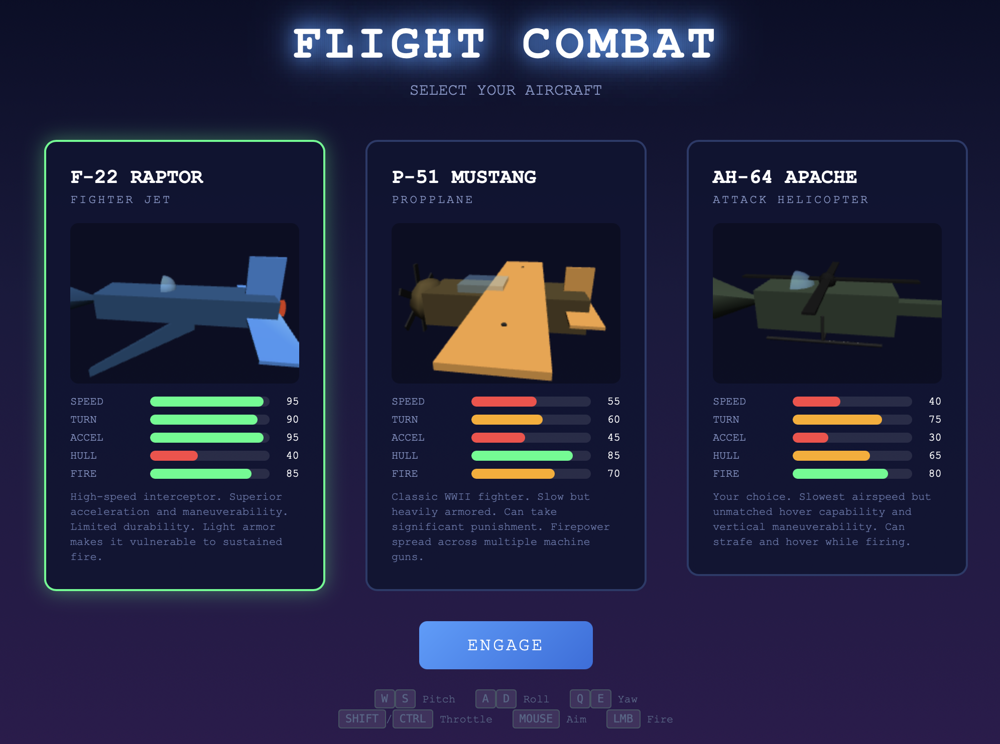
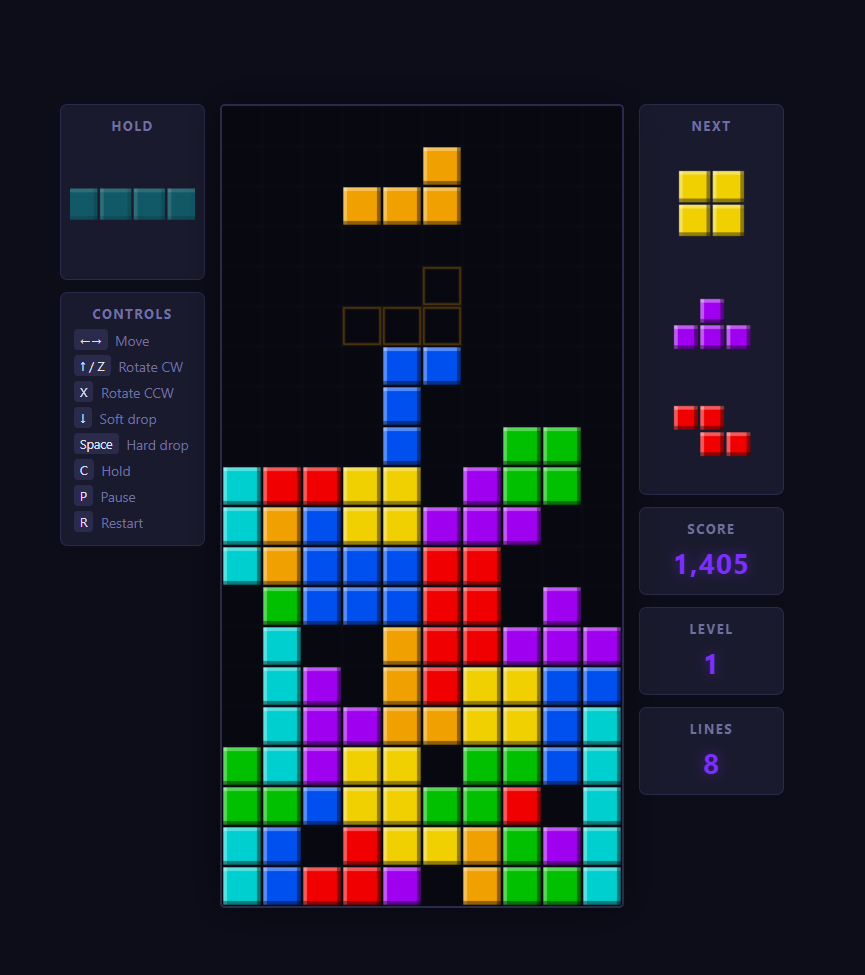
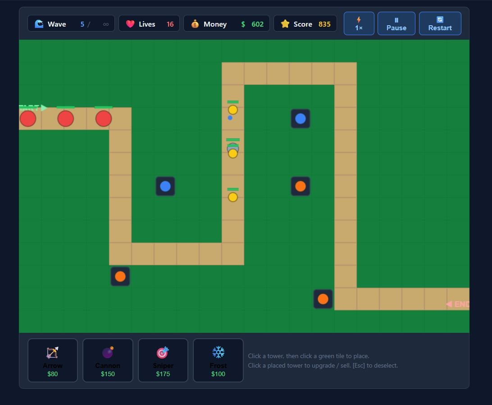

# Applications

## Table of Contents
- [Flight Combat](#flight-combat)
  - [Prompt](#prompt)
  - [Generation History](./flight-combat/COMMENTS.md)
  - [Last Generated Code](#last-generated-code)
- [Tetris](#tetris)
  - [Prompt](#prompt-1)
  - [Generation History](#generation-history)
  - [Last Generated Code](#last-generated-code-1)
- [Tower Defense](#tower-defense)
  - [Prompt](#prompt-2)
  - [Generation History](#generation-history-1)
  - [Last Generated Code](#last-generated-code-2)

## Flight Combat

The Flight Combat example is an MVP implementation of a 3D aerial dogfighting game, built to demonstrate aircraft selection, distinct flight characteristics, combat mechanics, and progressively challenging enemy encounters in a compact format. It is intended as a practical example of how a single prompt can produce a playable flight combat game with only limited post-generation refinements.

### Prompt

"*Design and create flight combat simulator game. The game must feature 3d graphics in any style you choose.* 

*A Start Screen that allows the user to select the plane they will use. The user may select from three potential options as follows: A fighter Jet, A Propeller Plane, An option of your choosing.* 

*Each Plane must have realistic limitations on its performance, which should also be displayed graphically on the plane selection screen.*

*Once the plane is selected and the game started, there will be a dynamic number of opposing planes the user can engage in a dogfight with. There MUST be visible ammunition traces, as well as functional damage implementation for both enemy and player planes.* 

*If the player defeats all enemy planes in a round, the level repeats with increased difficulty. If the player loses, the plane they are in becomes uncontrollable and falls to the ground, returning them to the home screen following a 2 second black screen.* 

*You may use any library for this implementation, but it must be contained within a single script, and be able to be opened and played in the chrome browser.*"

### Last Generated Code

#### Coding by Local LLM

- [Ornith 1.0 version documentation](./flight-combat/by-ornith-1.0/README.md)

### Credits

The prompt was inspired by [Bijan Bowen](https://www.youtube.com/@bijanbowen) who’s been running similar tests on YouTube.

## Tetris

The Tetris example is an MVP implementation of the classic block-stacking game, built to demonstrate core gameplay mechanics, playability, and prompt-driven development in a compact format. It is intended as a practical example of how a single prompt can produce a working game with only limited post-generation refinements.

### Prompt

"*Build a complete Tetris game with standard rules: a 10x20 playfield, seven tetromino types, line clearing mechanics, and increasing difficulty. Include controls for moving, rotating, soft/hard dropping pieces, and holding a piece. Implement scoring based on lines cleared and levels that increase fall speed. Ensure the game ends when the stack reaches the top. Provide a clean UI with on-screen stats (score, level) and options to pause/restart. Keep the code clean and modular and ship a playable, balanced MVP.*"

### Generation History

This application is available in three versions: one generated by **Claude Sonnet 4.6** (the strongest in graphical presentation and design), one generated by **GPT-5.3-codex** (equally valid in gameplay terms, but with a slightly rougher presentation), and one generated by **Gemini Pro 3.1** (graphically solid, though not at Sonnet's level, but the only version that required no post-generation edits).

**May 2026** The project was extended to include models run locally through Ollama. The hardware used is a MacBook Pro M4 Max with 64 GB of memory, running macOS Tahoe.

**June 2026** Systematic testing of models suitable for local use began. At this stage, Ollama, VS Code, and GitHub Copilot were used. The corresponding report is [COMMENTS.md](./tetris/COMMENTS.md).

The first model to be tested was **Qwen3-coder:30b**, made available by Alibaba. The outcome was very good, although a number of additional prompts were required to correct errors and functional issues. Overall, this local model produced a working implementation with a strong visual design, even though it took longer to complete. Even so, building Tetris in this way remained far quicker and more efficient than writing all the code by hand.

**June 2026**

The first model found to meet the speed and quality requirements for local use was **gemma4:31b-nvfp4**. This result was achieved on a hardware and software configuration that, although fairly common, still excludes a substantial proportion of desktop and laptop systems.

**July 2026**

The **Ornith-1.0-35B-4bit** model produced the best overall implementation of Tetris in less than 10 minutes.

### Last Generated Code

#### Coding by Provider

- [Codex version documentation](./tetris/by-codex/README.md)
- [Gemini version documentation](./tetris/by-gemini/README.md)
- [Sonnet version documentation](./tetris/by-sonnet/README.md)

#### Coding by Local LLM

- [Gemma 4 version documentation](./tetris/by-gemma4:31b-nvfp4/README.md)
- [Qwen3-Coder version documentation](./tetris/by-qwen3-coder/README.md)
- [Ornith 1.0 version documentation](./tetris/by-ornith-35b/README.md)

## Tower Defense

The Tower Defense example is a playable browser-based MVP in which the player places and upgrades defensive towers to stop waves of enemies moving along a fixed path. It demonstrates a strong one-prompt outcome for game logic, user interaction, balancing basics, and clear visual feedback, while remaining small enough to study as a practical learning example.

### Prompt

"*Build a complete tower defense game with a fixed path where enemies spawn in waves, you earn money per kill, and you lose lives when enemies reach the end. Include at least 3 tower types (different range/damage/attack speed) with upgrades, plus a simple UI to place/sell/upgrade towers and start the next wave; keep the code clean and modular and ship a playable, balanced MVP. Include basic polish: pause/restart + on-screen stats (wave, lives, money).*"

### Generation History

This application is presented in three versions: one generated by **Claude Sonnet 4.6**, one generated by **GPT-5.3-codex**, and one generated by **Gemini Pro 3.1**. The Gemini version is the only one that required multiple fixes to resolve display overlap issues and logic problems, and its original output does not qualify as a single-prompt MVP application under this project's definition.

### Last Generated Code

#### Coding by Provider

- [Codex version documentation](./tower-defense/by_codex/README.md)
- [Gemini version documentation](./tower-defense/by-gemini/README.md)
- [Sonnet version documentation](./tower-defense/by-sonnet/README.md)

#### Credits

The prompt was inspired by Dan Cleary (converge.run). See the related [Medium article](https://medium.com/codex/i-tested-sonnet-4-6-vs-opus-4-6-for-vibe-coding-heres-the-winner-4165870c8a3a) and [YouTube video](https://www.youtube.com/watch?v=zByO-D2IsRY&t=334s).

## Document History

| Date | Description | Author |
|---|---|---|
| 24 july 2026 | Added Flight Combat development with local LLM (Ornith 1.0) |
| 8 July 2026 | Moved to apps/APPLICATIONS.md file. | dden |
| 9 June 2026 | Added Tetris development with local LLM (Gemma4 31b). | dden |
| 26 May 2026 | Added Tetris development with local LLM (Qwen3-Coder). | dden |
| 28 February 2026 | Updated the Tetris and Tower Defense comparison paragraphs to include Gemini Pro 3.1 assessment notes and MVP compliance clarification. | dden/codex |
| 26 February 2026 | Added the Tetris overview section and model comparison notes. | dden/codex |
| 26 February 2026 | Added the initial document history section. | dden/codex |
