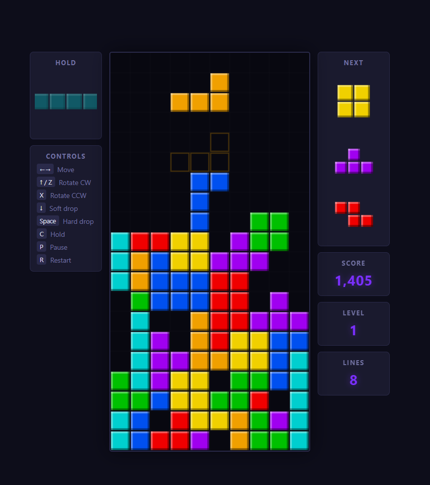

# Applications

## Table of Contents
- [Flight Combat](./flight-combat/FLIGHT-COMBAT-APPLICATION.md)
  - [Approach](./flight-combat/FLIGHT-COMBAT-APPLICATION.md#approach)
  - [Prompt](./flight-combat/FLIGHT-COMBAT-APPLICATION.md#prompt)
  - [Preview](./flight-combat/FLIGHT-COMBAT-APPLICATION.md#preview)
  - [Comments](./flight-combat/COMMENTS.md)
- [Pac-Man](./pac-man/PAC-MAN-APPLICATION.md)
  - [Approach](./pac-man/PAC-MAN-APPLICATION.md#approach)
  - [Prompt](./pac-man/PAC-MAN-APPLICATION.md#prompt)
  - [Preview](./pac-man/PAC-MAN-APPLICATION.md#preview)
- [Tetris](#tetris)
  - [Prompt](#prompt-1)
  - [Generation History](#generation-history)
  - [Last Generated Code](#last-generated-code-1)
- [Tower Defense](./tower-defense/TOWER-DEFENSE-APPLICATION.md)
  - [Prompt](./tower-defense/TOWER-DEFENSE-APPLICATION.md#prompt)
  - [Preview](./tower-defense/TOWER-DEFENSE-APPLICATION.md#preview)
  - [Comments](./tower-defense/COMMENTS.md)

## Tetris

The Tetris example is an MVP implementation of the classic block-stacking game, built to demonstrate core gameplay mechanics, playability, and prompt-driven development in a compact format. It is intended as a practical example of how a single prompt can produce a working game with only limited post-generation refinements.

### Prompt

"*Build a complete Tetris game with standard rules: a 10x20 playfield, seven tetromino types, line clearing mechanics, and increasing difficulty. Include controls for moving, rotating, soft/hard dropping pieces, and holding a piece. Implement scoring based on lines cleared and levels that increase fall speed. Ensure the game ends when the stack reaches the top. Provide a clean UI with on-screen stats (score, level) and options to pause/restart. Keep the code clean and modular and ship a playable, balanced MVP.*"

### Generation History

This application is available in three versions: one generated by **Claude Sonnet 4.6** (the strongest in graphical presentation and design), one generated by **GPT-5.3-codex** (equally valid in gameplay terms, but with a slightly rougher presentation), and one generated by **Gemini Pro 3.1** (graphically solid, though not at Sonnet's level, but the only version that required no post-generation edits).

**May 2026** The project was extended to include models run locally through Ollama. The hardware used is a MacBook Pro M4 Max with 64 GB of memory, running macOS Tahoe.

**June 2026** Systematic testing of models suitable for local use began. At this stage, Ollama, VS Code, and GitHub Copilot were used. The corresponding report is [COMMENTS.md](./tetris/COMMENTS.md).

The first model to be tested was **Qwen3-coder:30b**, made available by Alibaba. The outcome was very good, although a number of additional prompts were required to correct errors and functional issues. Overall, this local model produced a working implementation with a strong visual design, even though it took longer to complete. Even so, building Tetris in this way remained far quicker and more efficient than writing all the code by hand.

**June 2026**

The first model found to meet the speed and quality requirements for local use was **gemma4:31b-nvfp4**. This result was achieved on a hardware and software configuration that, although fairly common, still excludes a substantial proportion of desktop and laptop systems.

**July 2026**

The **Ornith-1.0-35B-4bit** model produced the best overall implementation of Tetris in less than 10 minutes.

**September 2026**

The **qwen3.8-flash-next:4bit** model generated a very good and compact implementation of the game in a long run (one hour). The implementation is accurate and doesn't have any errors. The reason for the long run is the approach of the Slotstream engine, which loads only the necessary parts of the model from the disk. Here the bottleneck is the reading speed of the SSD; this approach makes it possible to run bigger models on hardware with a limited amount of RAM.

### Last Generated Code

#### Coding by Provider

- [Codex version documentation](./tetris/by-codex/README.md)
- [Gemini version documentation](./tetris/by-gemini/README.md)
- [Sonnet version documentation](./tetris/by-sonnet/README.md)

#### Coding by Local LLM

- [Gemma 4 version documentation](./tetris/by-gemma4:31b-nvfp4/README.md)
- [Qwen3-Coder version documentation](./tetris/by-qwen3-coder/README.md)
- [Qwen3.8-flash-next version documentation](./tetris/by-qwen3.8-flash-next/README.md)
- [Ornith 1.0 version documentation](./tetris/by-ornith-1.0-35b/README.md)

## Document History

| Date | Description | Author |
|---|---|---|
| 5 October 2026 | Pac Man application reference implementation | Daniele Denti |
| 30 September 2026 | Flight Combat and Tower Defense moved to dedicated files | Daniele Denti |
| 24 September 2026 | Added Tetris development with local LLM (Qwen 3.8 flash next) | Daniele Denti |
| 24 July 2026 | Added Flight Combat development with local LLM (Ornith 1.0) | dden |
| 8 July 2026 | Moved to apps/APPLICATIONS.md file. | dden |
| 9 June 2026 | Added Tetris development with local LLM (Gemma4 31b). | dden |
| 26 May 2026 | Added Tetris development with local LLM (Qwen3-Coder). | dden |
| 28 February 2026 | Updated the Tetris and Tower Defense comparison paragraphs to include Gemini Pro 3.1 assessment notes and MVP compliance clarification. | dden/codex |
| 26 February 2026 | Added the Tetris overview section and model comparison notes. | dden/codex |
| 26 February 2026 | Added the initial document history section. | dden/codex |
