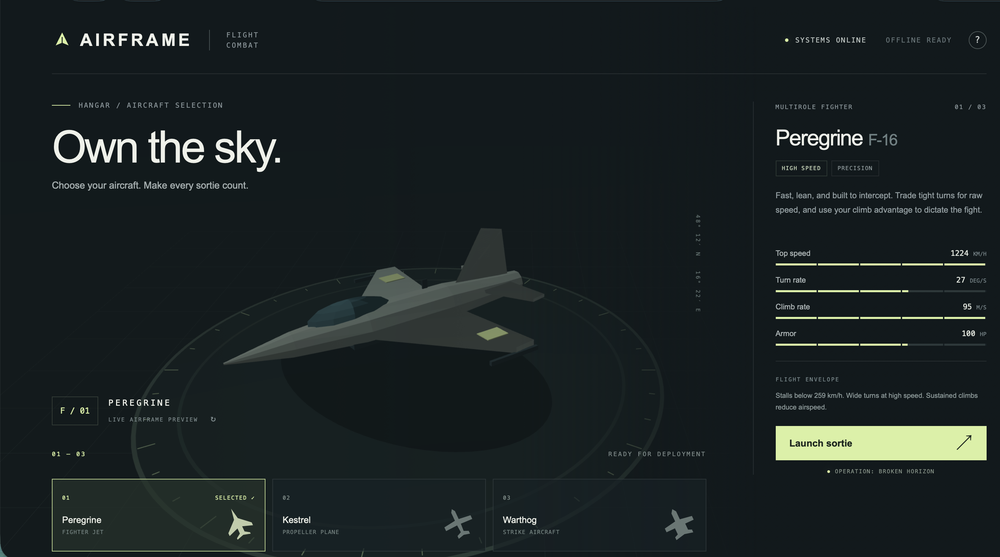

# AIRFRAME



A self-contained 3D flight combat game, written from scratch in JavaScript and WebGL. No libraries, installation, build step, CDN, fonts, images, or network access are required. All aircraft, terrain, effects, and audio are generated by the game.

## Play

Open **index.html** in a current browser with WebGL enabled. It works directly from disk. Alternatively, serve this directory:

```sh
python3 -m http.server 8080
```

Then visit `http://localhost:8080`.

Choose a Peregrine fighter jet, Kestrel propeller fighter, or Warthog twin-engine strike aircraft and press **Launch sortie**.

| Control | Action |
| --- | --- |
| Mouse movement | Steer; center the mouse to fly straight |
| W / S or up / down | Pitch up / down |
| A / D or left / right | Bank and turn |
| Q / E | Decrease / increase throttle |
| Space or left mouse button | Fire cannons |
| Escape | Pause / resume |
| Touch stick and FIRE | Touch controls |

Keyboard steering takes over from mouse steering until the mouse moves again. Pausing or leaving the window releases all controls. Touch flight uses the initial 72% throttle.

## Flight and combat

The flight model is an accessible approximation, not an engineering simulator. Aircraft names evoke their real-world roles; displayed values define the game's tuned flight envelopes, rather than certified real-aircraft specifications.

- Aircraft have enforced speed, acceleration, turn, climb, stall, ceiling, armor, damage, and cannon temperature limits. Turn-rate bars describe performance at 65% of top speed. High speed widens turns; climbs consume airspeed; low speed causes a stall and descent.
- Enemy planes maneuver, lead targets, and fire visible red-orange projectiles. Player rounds leave gold traces. Swept projectile collision checks apply real damage to either side. A small forward aiming assist helps lead targets inside the gunsight.
- Cannon ammunition is unlimited; sustained fire overheats the weapon until it cools. Short bursts are more effective.
- The first wave contains three hostiles. Subsequent waves increase the number (up to twelve), armor, maneuvering, firing frequency, and damage. Clearing a wave repairs the player and starts the next wave after four seconds.
- Ground and aircraft collisions cause damage. At zero health the player's controls fail, the aircraft tumbles and falls, and ground impact triggers exactly two seconds of black screen before returning to the hangar. Flight and blackout timers stop progressing while the browser is suspended.
- The radar and edge indicators locate offscreen opponents. A soft boundary turns aircraft back toward the island chain.

## Source

- `index.html`, `style.css`: hangar, selection, controls, instruments, responsive layout.
- `engine.js`: WebGL shaders, camera, matrices, mesh generation, aircraft models.
- `simulation.js`: independent flight physics, AI, projectiles, damage, waves, loss state machine.
- `game.js`: scene, terrain, input, HUD, particles, synthesized audio.
- `simulation.test.cjs`: executable behavioral tests for the simulation.
- `engine.test.cjs`: camera, orientation, geometry, and local-asset checks. These do not replace visual GPU testing.

Run checks with Node.js:

```sh
node --test simulation.test.cjs engine.test.cjs
```

The game has no persistent data or backend. Reloading resets the sortie.
