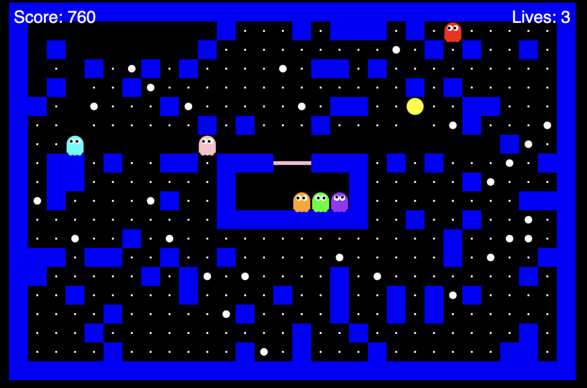

# PAC-MAN

The Pac-Man application is a reimplementation of the famous vintage game.

## Approach

Here the idea is to start from an existing implementation in Python and to ask the model to reimplement it as single file browser only application. This approach should test the skill in case of a migration to a different implemetation stack.

## Prompt

The detailed prompt is [here](../../prompts/pacman.prompt.md)

## Generation History

The reference implementation was done first using Codex GPT-6 Astra and finished by GitHub Copilot and Claude Sonnet 5.5 due to an outage of Codex.

## Preview

### Documentation

- [Codex version documentation](./by-codex-gpt-6/README.md)
