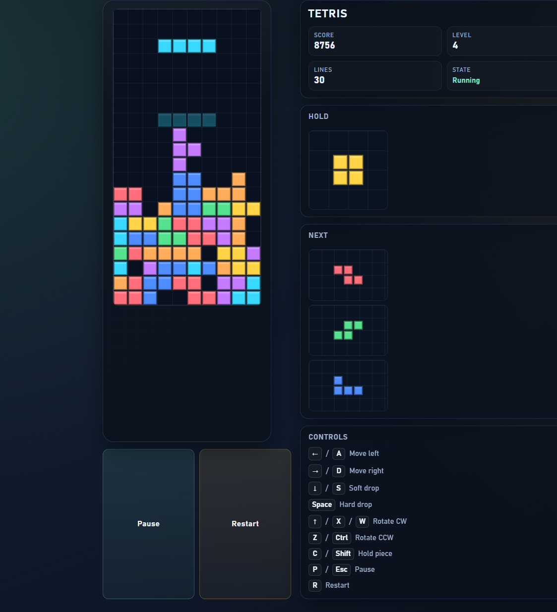

# Tetris

A complete, playable Tetris implementation built as a single-prompt app.



## Play

Open `index.html` directly in a browser — no build step required. Because the code uses ES modules you need to serve it from a local HTTP server (or use VS Code's Live Server extension):

```bash
# Python
python -m http.server 8080
# Node
npx serve .
```

Then navigate to `http://localhost:8080`.

## Controls

| Key | Action |
|-----|--------|
| ← / A | Move left |
| → / D | Move right |
| ↓ / S | Soft drop |
| ↑ / W / X | Rotate clockwise |
| Z / Ctrl | Rotate counter-clockwise |
| Space | Hard drop |
| C / Shift | Hold piece |
| P / Esc | Pause / Resume |
| R | Restart |

## Features

- **10 × 20 playfield** with 2 hidden buffer rows for spawning
- **7-bag randomizer** – all 7 tetrominoes appear before repeats
- **SRS (Super Rotation System)** kick tables for JLSTZ and I pieces
- **Ghost piece** shows where the active piece will land
- **Hold queue** – hold one piece per drop
- **Next queue** – previews the next 3 pieces
- **Lock delay** – 500 ms before grounded pieces lock
- **Scoring** – line clears use standard points (×level): 1L=100, 2L=300, 3L=500, 4L=800
- **Drop scoring** – soft drop earns 1 pt/cell, hard drop earns 2 pts/cell
- **Level progression** – level increases every 10 lines
- **Gravity scaling** – fall interval speeds up by level down to a 60 ms minimum
- **Pause/game-over overlays** plus auto-pause when the tab loses focus

## File structure

```text
tetris/
  index.html        – markup + layout
  styles.css        – dark-theme styling
  src/
    constants.js    – board constants, scoring, gravity timing, colors
    tetrominoes.js  – piece shapes, SRS kick tables, spawn helpers
    randomBag.js    – 7-bag queue randomizer
    game.js         – game loop, movement, rotation, lock/clear, scoring, hold
    renderer.js     – canvas drawing (board, ghost, previews, overlays)
    input.js        – keyboard controls and key handling
    main.js         – wires everything together
```
