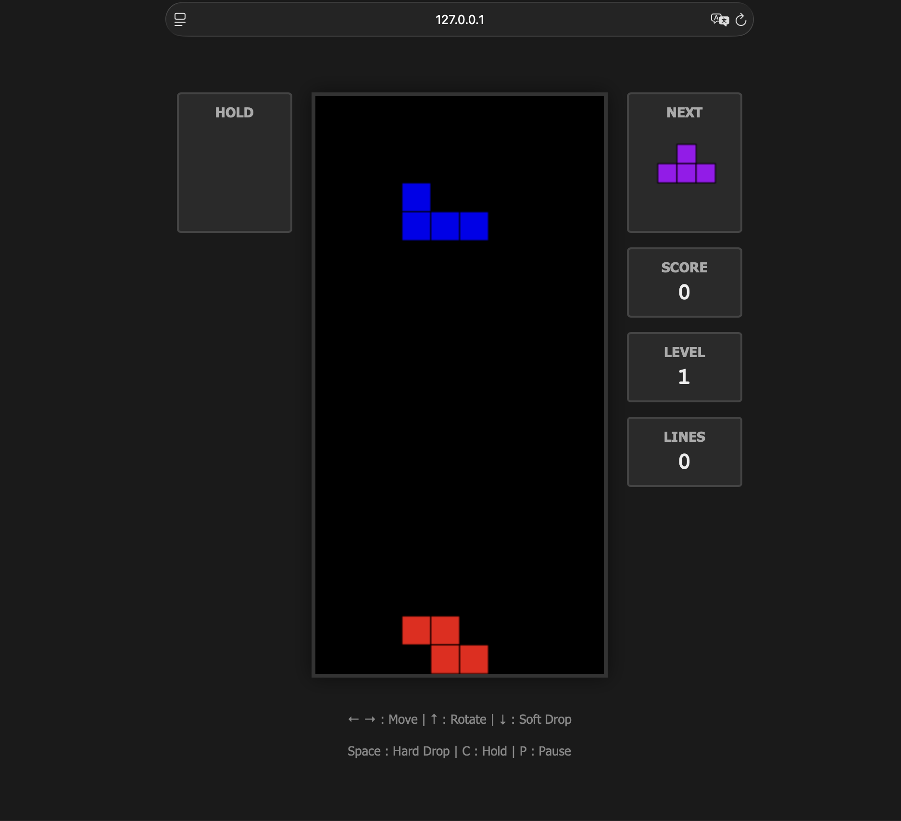

# Tetris - Gemma 4

A complete, playable Tetris implementation built as a single-prompt app.



## Play

Open `index.html` directly in a browser — no build step required. Because the code uses ES modules, you need to serve it from a local HTTP server (or use VS Code's Live Server extension):

```bash
# Python
python -m http.server 8080
# Node
npx serve .
```

Then navigate to `http://localhost:8080`.

## Controls

| Key | Action |
|-----|--------|
| ← / Left Arrow | Move left |
| → / Right Arrow | Move right |
| ↓ / Down Arrow | Soft drop |
| ↑ / Up Arrow | Rotate clockwise |
| Space | Hard drop |
| C | Hold piece |
| P | Pause / Resume |

## Features

- **10 × 20 playfield** for classic gameplay.
- **7 standard tetrominoes** with distinct colors.
- **Hold queue** – save a piece for later use.
- **Next preview** – see the upcoming piece.
- **Line clearing** – clear full rows to score points and move blocks down.
- **Scoring & Levels** – score increases by lines cleared; level increases every 10 lines, speeding up the fall rate.
- **Game Over state** – game ends when the stack reaches the top.
- **UI Overlays** – clean interface for pausing and restarting the game.

## File structure

```text
tetris/
  index.html              – markup + layout
  style.css               – styling
  src/
    main.js               – entry point, game loop, and input handling
    board.js              – board state and collision logic
    piece.js              – tetromino definitions and rotation
    constants.js          – game constants (colors, shapes)
    renderer.js           – canvas drawing logic
```