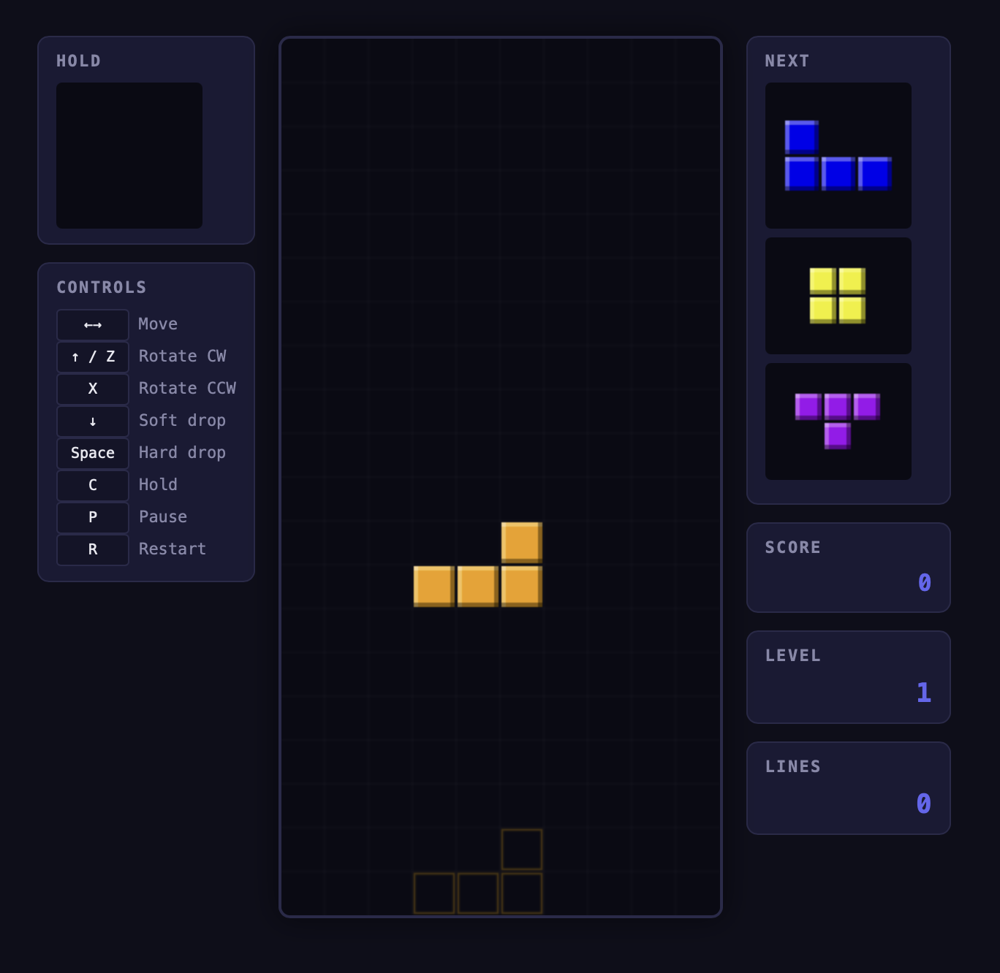

# Tetris – by Ornith 1.0 35b

A complete, standard-rule Tetris implementation built as a single-page vanilla web app (HTML5 + CSS3 + JavaScript ES Modules with Canvas 2D rendering).



## How to run

Open `index.html` directly in a browser, or serve the directory:

```bash
cd apps/tetris/by-ornith-35b
python3 -m http.server 8080
# Then visit http://localhost:8080
```

## Controls

| Key          | Action           |
|--------------|------------------|
| `←` `→`      | Move left/right  |
| `↑` / `Z`    | Rotate clockwise |
| `X`          | Rotate counter-clockwise |
| `↓`          | Soft drop        |
| `Space`      | Hard drop        |
| `C` / `Shift`| Hold piece       |
| `P` / `Esc`  | Pause / unpause  |
| `R`          | Restart game     |

## Features

- **Standard 10×20 playfield** with 2 buffer rows above for spawning
- **7-bag randomizer** – guarantees one of each piece per bag (competitive standard)
- **SRS (Super Rotation System)** with full wall kick tables for all 7 piece types
- **Ghost piece** – translucent outline showing where the piece will land
- **Hold queue** – swap the current piece with the hold buffer (once per piece)
- **Next queue** – 3-piece preview
- **Lock delay** – 500ms before locking on the ground, with up to 15 resets for movement/rotation
- **Scoring** – 100/300/500/800 points for 1/2/3/4 lines, multiplied by level
- **Leveling** – every 10 lines cleared raises the level (capped at 15); fall speed increases each level
- **Soft drop** awards 1 point per cell, **hard drop** awards 2 points per cell
- **Game over** when the stack reaches the top buffer rows
- **Pause/resume** with overlay, **restart** with button or `R` key

## Architecture

```
src/
├── tetrominos.js   – Piece definitions (7 types, 4 rotation states), SRS wall kicks, 7-bag randomizer
├── board.js        – Board grid (10×22), collision detection, lock, line clear, hard drop, ghost
├── game.js         – State machine, 7-bag management, scoring, gravity, lock delay
├── input.js        – Keyboard input with DAS/ARR (delayed auto-shift / auto-repeat)
├── renderer.js     – Canvas 2D rendering (board, pieces, ghost, previews, overlays)
└── main.js         – Entry point: wires Game + Renderer + InputHandler
```

## Scoring

| Lines cleared | Base points | × Level |
|:-------------:|:-----------:|:-------:|
| 1 (single)    | 100         | × level |
| 2 (double)    | 300         | × level |
| 3 (triple)    | 500         | × level |
| 4 (tetris)    | 800         | × level |

Soft drop: +1 per cell. Hard drop: +2 per cell.

## Level progression

| Level | Fall interval (ms) |
|:-----:|:------------------:|
| 1     | 800                |
| 2     | 720                |
| 3     | 630                |
| 4     | 550                |
| 5     | 470                |
| 6     | 380                |
| 7     | 300                |
| 8     | 220                |
| 9     | 140                |
| 10    | 80                 |
| 11    | 80                 |
| 12    | 70                 |
| 13    | 70                 |
| 14    | 60                 |
| 15+   | 60 (capped)        |
