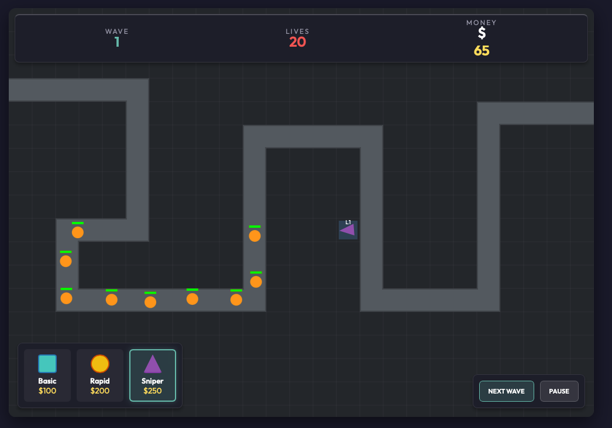

# Tower Defense



## Overview

This project is a playable tower defense MVP built as a browser game with a fixed enemy path, wave-based spawning, tower placement/upgrades, and basic game-state controls (pause/restart).

The design goal was to ship a clean, modular implementation that is easy to read, tune, and extend.

## Architect Requirement (Prompt to the AI)

The architect asked the AI to build a complete tower defense game with these core requirements:

- A fixed path that enemies follow
- Enemies spawn in waves
- The player earns money for each enemy kill
- The player loses lives when enemies reach the end of the path
- At least 3 tower types with different stats (range, damage, attack speed)
- Tower upgrades
- A simple UI to place, sell, and upgrade towers
- A control to start the next wave
- On-screen stats for wave, lives, and money
- Basic polish including pause and restart
- Clean, modular, playable, and reasonably balanced MVP quality

## Implementation

The game is implemented as a lightweight front-end browser app using HTML, CSS, and modular JavaScript.

### Core gameplay systems

- **Game loop**: Handles update/render timing, pausing, restart flow, and high-level game state.
- **Path system**: Defines a fixed route and moves enemies along it based on speed and progress.
- **Wave manager**: Generates and schedules enemy spawns for each wave with scaling difficulty.
- **Enemy system**: Tracks enemy health, movement, rewards, and life damage when an enemy escapes.
- **Tower system**: Supports multiple tower archetypes with unique range/damage/fire-rate tradeoffs.
- **Projectile/combat system**: Towers target enemies, fire projectiles, and apply damage/rewards on kill.
- **Economy**: Money is spent on placement/upgrades and earned from kills; selling returns a partial refund.
- **UI layer**: Exposes tower build selection, selected tower details, upgrade/sell actions, wave start, pause, restart, and status messaging.

### Tower types (MVP set)

The MVP includes three distinct towers:

- **Basic**: Balanced range and damage, reliable all-purpose tower
- **Rapid**: Fast attack speed, shorter range, strong sustained damage near corners/chokepoints
- **Sniper**: Slow but heavy-hitting long-range tower for tougher enemies

Each tower supports upgrades that improve its stats and increase its effectiveness later in the run.

### Balance approach (MVP)

The game is tuned as a starter experience:

- Early waves are beatable with a small number of smart placements
- Enemy composition grows more varied over time (faster and tankier enemies)
- Rewards scale with wave difficulty to support continued upgrades
- Tower roles stay differentiated so there is a meaningful build choice

## How to Use

### Running the game

Open the game in a browser (preferably through a simple local static server if the project uses ES modules).

```bash
# Python
python -m http.server 8080
# Node
npx serve .
```

Then navigate to `http://localhost:8080`.

### Controls

- **Select a tower type** from the build panel
- **Click a valid tile** on the board to place the tower
- **Click an existing tower** to inspect it
- Use the **Upgrade** button to improve the selected tower (if you have enough money)
- Use the **Sell** button to remove the selected tower and get a partial refund
- Click **Start Next Wave** to spawn the next enemy wave
- Click **Pause** to pause/resume gameplay
- Click **Restart** to reset the run

### Game Rules

1. Enemies follow the fixed path from spawn to exit.
2. Towers attack enemies automatically when targets are in range.
3. Killing enemies grants money.
4. If an enemy reaches the end of the path, you lose lives.
5. You lose the game when lives reach `0`.
6. Waves must be cleared before starting the next one (unless the game explicitly allows overlapping waves in a future version).
7. Spend money on new towers and upgrades to keep up with scaling enemy waves.

### Strategy tips (optional but useful)

- Place balanced towers first to stabilize early waves
- Use fast towers near turns/exits to maximize time-on-target
- Add heavy-hitting towers to handle tougher enemies in later waves
- Upgrade towers with good coverage before overbuilding low-impact placements

## MVP Scope Notes

This is a polished MVP focused on core gameplay and usability. It is designed to be extended later with features such as:

- More enemy/tower types
- Special abilities or status effects
- Additional maps with different path configurations
- Sound effects and better visual polish

## File structure

```text
tower-defense/
  index.html    – markup + layout
  style.css     – styling
  game.js       – game loop, state management, and core logic
  entities.js   – tower, enemy, and projectile definitions
  ui.js         – UI controls and display updates
```
## Development

- [Click here](./implementation_plan.md) to display the development plan generated and used by Gemini Pro 3.1
- [Click here](./task.md) to display the task performend by Gemini Pro 3.1