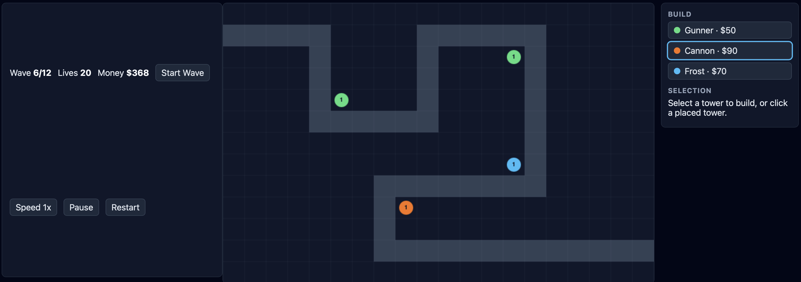

# Tower Defense — by qwen3.8-flash-next

A playable tower defense MVP: a fixed winding path, 12 enemy waves,
three tower types with upgrades, and a place/sell/upgrade UI.

## Play

Open `index.html` in a browser (ES modules — no build step, no CDN
needed). Click a tower card in the **Build** panel, then click a grass
tile to place it. Click a placed tower to inspect, upgrade or sell it.
Right-click (or click the selected card again) to cancel placement.
Press **Start Wave** when ready; **Speed 1x/2x** fast-forwards,
**Pause** freezes, **Restart** resets everything.

## Towers

| Tower | Cost | Role |
|-------|------|------|
| Gunner | $50 | Cheap, fast-firing all-rounder |
| Cannon | $90 | Slow, heavy hits with splash damage |
| Frost | $70 | Low damage, slows enemies (stacks with DPS) |

Each tower has 3 levels; upgrades raise damage/range/fire rate.
Selling refunds 70% of total investment.

## Balance notes

- Start with $120 (two Gunners or one Cannon + savings).
- Waves scale in count and HP multiplier (up to ×1.6 by wave 12).
- Tanks and bosses punish thin coverage; mix Cannon (burst) with
  Frost (kiting) and Gunner (sustained DPS).

## Layout

- `src/config.js` — tunable data: path, towers, enemies, waves
- `src/path.js` — path geometry (positions, buildable cells)
- `src/entities.js` — Enemy / Tower / Projectile classes
- `src/game.js` — game state machine and simulation
- `src/render.js` — canvas drawing
- `src/main.js` — DOM wiring and frame loop
